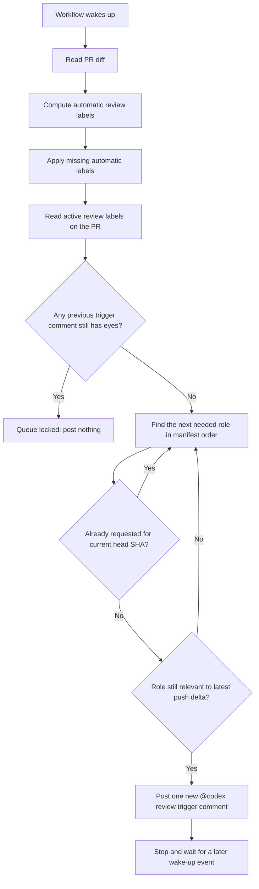
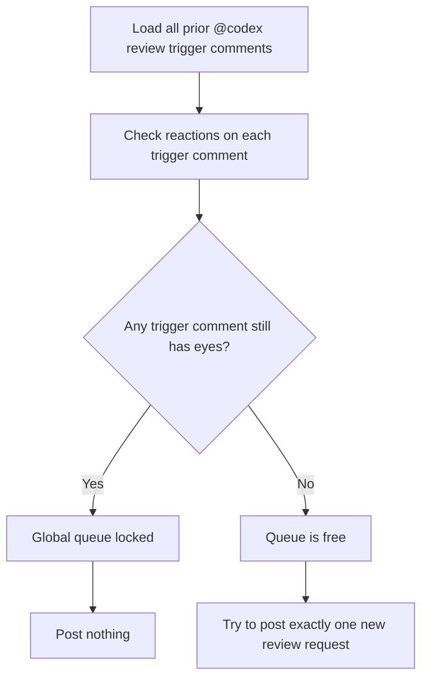
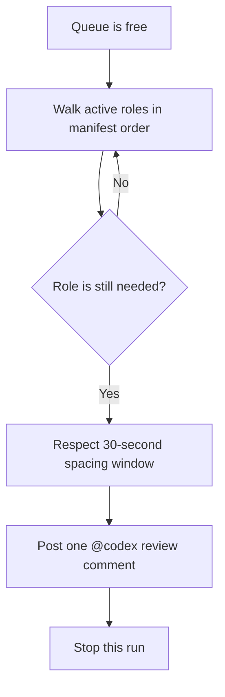

> **When to read this:** When you want to understand the automated Codex review workflow itself: what wakes it up, how labels are derived, why reviews may or may not be posted, and how the queue advances.

# Codex Review Flow

This document explains the current automated Codex review workflow implemented in `.github/workflows/codex-review.yml` and driven by `.github/codex-review-roles.json`.

The key design choice is:

1. automatic labels are derived from the PR diff
2. review requests are posted through a single global queue per PR
3. at most one new `@codex review` trigger is posted per workflow run
4. no new trigger is posted while an earlier trigger comment still has Codex's in-progress `eyes` reaction

If you only remember one thing, remember this:

> The workflow does **not** try to post every needed review at once anymore. It keeps a queue and advances one review request at a time.

## Source Files

- Workflow: `.github/workflows/codex-review.yml`
- Role catalog: `.github/codex-review-roles.json`
- Condensed trigger prompts: `.github/prompts/*.md`
- Detailed fallback prompts: `.github/prompts/detailed/*.md`

## High-Level Overview



## What Wakes Up The Workflow

The workflow can wake up from three kinds of events.

### 1. Pull Request Events

These are the normal routing and rerun events:

- `opened`
- `reopened`
- `synchronize`
- `ready_for_review`
- `labeled`

Use this mental model:

- `opened` and `reopened` start the queue
- `labeled` can add a manually requested role to the queue
- `synchronize` updates the PR head SHA and may make some prior roles stale
- `ready_for_review` resumes review activity after draft mode

### 2. Connector Comment Events

If `chatgpt-codex-connector[bot]` posts an issue comment on the PR thread, the workflow wakes up again.

Why this matters:

- Codex often leaves comments as part of review completion or review-status signaling
- those comments give the queue a chance to advance after an earlier review finishes

### 3. Connector Review Events

If `chatgpt-codex-connector[bot]` submits a PR review, the workflow also wakes up again.

Why this matters:

- a completed review is another signal that the queue may be able to advance

## Phase 1: Compute Automatic Labels

The workflow reads the changed files for the PR and compares them against the selectors in `.github/codex-review-roles.json`.

Each automatic role has:

- a label name
- a condensed prompt file
- a detailed prompt file
- a prompt version
- routing selectors such as `path_regex_any`

### Example

If the PR touches `docs/workflows/pr-open.md`, the docs-contract role matches.

If the PR touches `src/ftimer_mpi.F90`, several roles may match:

- software
- methodology
- red-team
- test-quality
- mpi-safety

The workflow then applies any missing automatic labels to the PR using `github.token`.

That token choice is deliberate:

- it avoids extra self-trigger churn from the workflow's own label writes
- the PAT is reserved for posting `@codex review` comments, because Codex ignores comments from `github-actions[bot]`

## Phase 2: Build The Active Role Queue

Once labels are reconciled, the workflow reads the actual labels on the PR and filters the role catalog down to the active Codex roles.

Those active roles are considered in manifest order.

Today that order is effectively:

1. software
2. methodology
3. red-team
4. docs-contract
5. test-quality
6. build-portability
7. api-compat
8. mpi-safety
9. optional deeper reviews after that, if labeled manually

Manifest order matters because the queue only posts one new review request per run.

## Phase 3: Global Queue Lock

This is the most important part of the workflow now.

Before posting anything new, the workflow fetches all prior `@codex review` trigger comments on the PR and checks their reactions.

If **any** earlier trigger comment still has the `eyes` reaction from Codex, the queue is treated as globally locked.



### Why The Lock Is Global

The global lock is intentionally stricter than a per-role lock.

That means:

- the queue will never stack multiple in-flight Codex review requests
- the tradeoff is slower throughput
- the benefit is less PR crowding and simpler behavior

## Phase 4: Decide Whether A Role Still Needs A Review

For each active role, the workflow asks three questions.

### Question 1: Was this exact role already requested for the current head SHA?

If yes, skip it.

The workflow tracks this using a hidden token embedded in every trigger comment:

```text
codex-review role=<role-id> sha=<head-sha> v=<prompt-version>
```

So a role will not be re-requested for the same commit and the same prompt version.

### Question 2: Did this role run before, but only on an older SHA?

If no, the role is eligible now.

If yes, keep going.

### Question 3: Does the file delta from that older SHA to the current head SHA still match this role's selectors?

If no, skip it.

If yes, it is eligible for rerun.

This is the noise-reduction logic for `synchronize`-style updates.

It means:

- a docs-only follow-up should not rerun MPI-focused reviews
- a workflow-only follow-up should not rerun test-quality unless the selectors say it should
- a role is rerun only when the latest change is still relevant to that role

## Phase 5: Post One New Trigger

If the queue is free and the workflow finds an eligible role, it:

1. waits for the configured 30-second spacing window if needed
2. loads the condensed one-line prompt for that role
3. posts a single `@codex review ...` comment
4. appends the hidden metadata token
5. stops immediately after posting that one comment

This is why the queue advances gradually rather than in a burst.



## How The Queue Advances Later

After one trigger is posted, the workflow does not continue posting the next role in the same run.

Instead, it waits for a future event.

The next wake-up may come from:

- a new push to the PR
- a manual label being added
- a connector comment
- a connector PR review

When the workflow wakes up again, it repeats the same checks:

1. are automatic labels still correct?
2. is the global queue still locked?
3. what is the next still-needed role?

If the prior trigger has completed and the `eyes` reaction is gone, the queue can advance to the next review.

## End-To-End Example

Suppose a PR initially touches:

- `.github/workflows/codex-review.yml`
- `docs/workflows/pr-open.md`

The matching roles might be:

1. software
2. docs-contract
3. build-portability

The queue behavior would look like this:

1. PR opens.
2. Automatic labels are applied.
3. Queue is free.
4. Workflow posts `software`.
5. Workflow stops.
6. Codex reacts with `eyes`.
7. A later workflow wake-up sees `eyes`, so it posts nothing.
8. Codex finishes and removes `eyes`.
9. A later workflow wake-up sees the queue is free.
10. Workflow posts `docs-contract`.
11. Workflow stops again.
12. Later, the same process repeats for `build-portability`.

## Current Tradeoffs

### Benefits

- Much less PR comment spam.
- Much clearer “one review at a time” behavior.
- Easier to reason about whether Codex is currently busy.
- Safer against overlapping or mixed-up reviews.

### Costs

- Reviews arrive more slowly.
- The queue can stall if the connector leaves `eyes` behind longer than expected.
- Older overlapping trigger comments from before the global-lock design can temporarily keep the queue blocked.
- Queue advancement depends on later wake-up events, not just the initial PR-open event.

## Practical Debug Checklist

If a review did not get posted, ask these in order:

1. Does the PR have any active Codex labels?
2. Did the role already get requested for the current `head.sha`?
3. Does any earlier trigger comment still have `eyes`?
4. If this is a rerun, did the file delta since the role's last-reviewed SHA still match the role's selectors?
5. Did the workflow stop after posting one earlier role in the queue?

## Reading The Hidden Metadata

Every trigger comment includes a hidden HTML comment like this:

```html
<!-- codex-review role=software sha=abc123... v=2 -->
```

Use it to answer:

- Which role was requested?
- For which commit SHA?
- Under which prompt version?

## Summary

The workflow is best understood as:

1. route labels from the current PR diff
2. maintain a single global review queue
3. never post a new trigger while any old trigger is still marked in-progress
4. post one new role at a time
5. only rerun a role when the latest change is still relevant to that role
