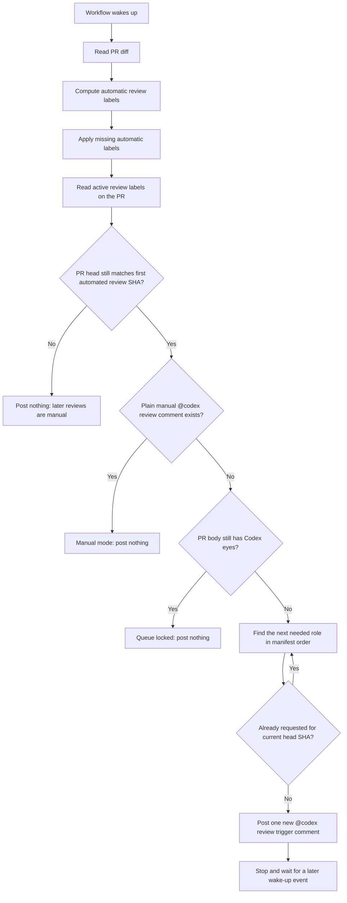
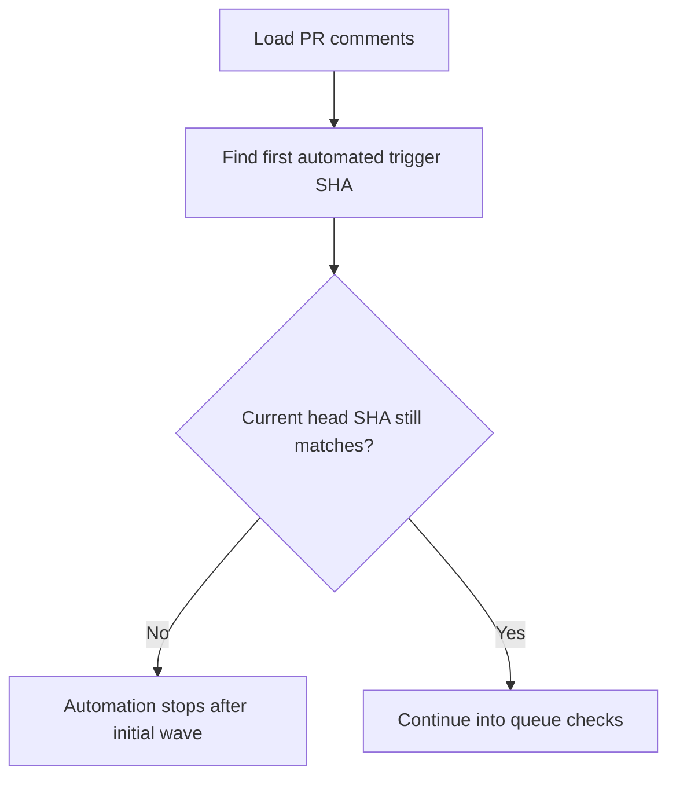
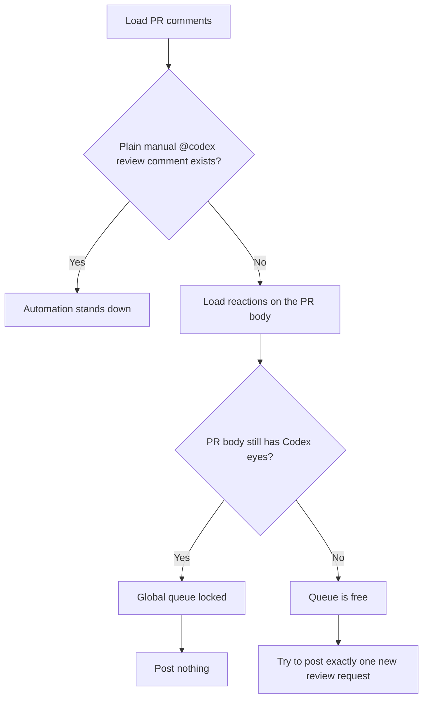
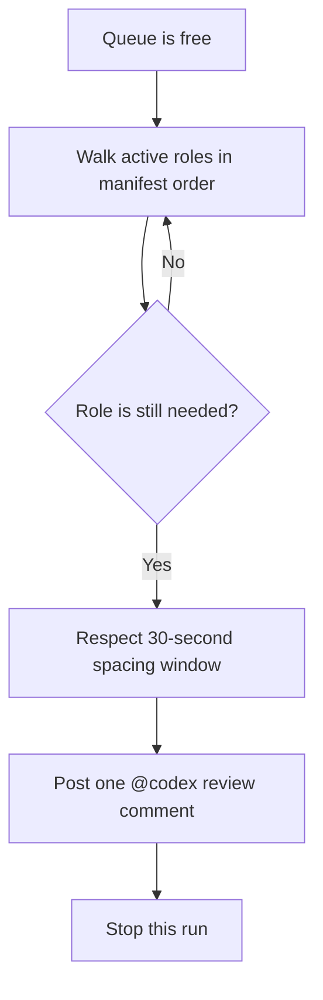

> **When to read this:** When you want to understand the automated Codex review workflow itself: what wakes it up, how labels are derived, why reviews may or may not be posted, and how the queue advances.

# Codex Review Flow

This document explains the current automated Codex review workflow implemented in `.github/workflows/codex-review.yml` and driven by `.github/codex-review-roles.json`.

The key design choice is:

1. automatic labels are derived from the PR diff
2. review requests are posted through a single global queue per PR
3. at most one new `@codex review` trigger is posted per workflow run
4. no new trigger is posted while the PR body still has Codex's in-progress `eyes` reaction
5. if a plain manual `@codex review` comment appears, the automated queue stands down for that PR
6. once the PR head moves past the first automated review wave, the automated queue stops and any further reviews are manual

If you only remember one thing, remember this:

> The workflow does **not** try to post every needed review at once anymore. It keeps a queue and advances one review request at a time.

## Source Files

- Workflow: `.github/workflows/codex-review.yml`
- Role catalog: `.github/codex-review-roles.json`
- Condensed trigger prompts: `.github/prompts/*.md`
- Detailed fallback prompts: `.github/prompts/detailed/*.md`

## High-Level Overview



## What Wakes Up The Workflow

The workflow can wake up from three kinds of events.

### 1. Pull Request Events

These are the normal routing events:

- `opened`
- `reopened`
- `ready_for_review`
- `labeled`

Use this mental model:

- `opened` and `reopened` start the queue
- `labeled` can add a manually requested role to the queue
- `ready_for_review` resumes review activity after draft mode

### 2. Connector Comment Events

If `chatgpt-codex-connector[bot]` posts an issue comment on the PR thread, the workflow wakes up again.

Why this matters:

- Codex often leaves comments as part of review completion or review-status signaling
- those comments give the queue a chance to advance after an earlier review finishes

### 3. Connector Review Events

If `chatgpt-codex-connector[bot]` submits a PR review, the workflow also wakes up again.

Why this matters:

- a completed review is another signal that the queue may be able to advance

## Phase 1: Compute Automatic Labels

The workflow reads the changed files for the PR and compares them against the selectors in `.github/codex-review-roles.json`.

Each automatic role has:

- a label name
- a condensed prompt file
- a detailed prompt file
- a prompt version
- routing selectors such as `path_regex_any`

### Example

If the PR touches `docs/workflows/pr-open.md`, the docs-contract role matches.

If the PR touches `src/ftimer_mpi.F90`, several roles may match:

- software
- methodology
- red-team
- test-quality
- mpi-safety

The workflow then applies any missing automatic labels to the PR using `github.token`.

That token choice is deliberate:

- it avoids extra self-trigger churn from the workflow's own label writes
- the PAT is reserved for posting `@codex review` comments, because Codex ignores comments from `github-actions[bot]`

## Phase 2: Build The Active Role Queue

Once labels are reconciled, the workflow reads the actual labels on the PR and filters the role catalog down to the active Codex roles.

Those active roles are considered in manifest order.

Today that order is effectively:

1. software
2. methodology
3. red-team
4. docs-contract
5. test-quality
6. build-portability
7. api-compat
8. mpi-safety
9. optional deeper reviews after that, if labeled manually

Manifest order matters because the queue only posts one new review request per run.

## Phase 3: Initial-Wave Guard

This is the most important part of the workflow now.

Before posting anything new, the workflow looks for the first automated trigger comment it ever posted on the PR and reads the SHA from its hidden metadata token.

If the current PR head SHA is different from that first automated-review SHA, the workflow stops immediately.

That is the rule that prevents iterative auto-review loops after follow-up pushes.

In plain language:

- the router may take a few wake-up events to finish posting the initial review wave
- but it only keeps doing that while the PR head has not changed
- after a push, any additional review requests are manual on purpose



## Phase 4: Global Queue Lock

Before posting anything new, the workflow checks whether the PR already contains a plain manual `@codex review` comment without the workflow metadata token.

If such a comment exists, the workflow assumes the PR is being driven manually and posts nothing further automatically.

Only if there is no plain manual request does it continue to the PR-body `eyes` lock check.

Before posting anything new, the workflow then checks reactions on the PR body itself.

If the PR body still has the `eyes` reaction from Codex, the queue is treated as globally locked.



### Why The Lock Is Global

The global lock is intentionally stricter than a per-role lock.

That means:

- the queue will never stack multiple in-flight Codex review requests
- the tradeoff is slower throughput
- the benefit is less PR crowding and simpler behavior

The workflow now uses the PR body reaction as that lock signal because it is a single shared place Codex already updates, and it avoids having to reason about many separate trigger comments.

The manual-override rule sits even earlier than that lock. Its purpose is simple:

- if a maintainer starts posting plain `@codex review` comments directly,
- the automated queue should stop posting its own requests,
- otherwise manual and automatic queue state can drift apart and duplicate requests can appear.

## Phase 5: Decide Whether A Role Still Needs A Review

For each active role, the workflow asks one question.

### Question 1: Was this exact role already requested for the current head SHA?

If yes, skip it.

The workflow tracks this using a hidden token embedded in every trigger comment:

```text
codex-review role=<role-id> sha=<head-sha> v=<prompt-version>
```

So a role will not be re-requested for the same commit and the same prompt version.

If no, the role is eligible now, as long as the queue is still within the initial automated-review wave for the current head SHA.

## Phase 6: Post One New Trigger

If the queue is free and the workflow finds an eligible role, it:

1. waits for the configured 30-second spacing window if needed
2. loads the condensed one-line prompt for that role
3. posts a single `@codex review ...` comment
4. appends the hidden metadata token
5. stops immediately after posting that one comment

This is why the queue advances gradually rather than in a burst.



## How The Queue Advances Later

After one trigger is posted, the workflow does not continue posting the next role in the same run.

Instead, it waits for a future event.

The next wake-up may come from:

- a manual label being added
- a connector comment
- a connector PR review

When the workflow wakes up again, it repeats the same checks:

1. are automatic labels still correct?
2. has the PR head moved past the first automated-review SHA?
3. did a manual `@codex review` comment take over this PR?
4. is the global queue still locked?
5. what is the next still-needed role?

If the PR-body `eyes` reaction is gone, the queue can advance to the next review.

## End-To-End Example

Suppose a PR initially touches:

- `.github/workflows/codex-review.yml`
- `docs/workflows/pr-open.md`

The matching roles might be:

1. software
2. docs-contract
3. build-portability

The queue behavior would look like this:

1. PR opens.
2. Automatic labels are applied.
3. No plain manual request exists.
4. Queue is free.
5. Workflow posts `software`.
6. Workflow stops.
7. Codex adds `eyes` to the PR body.
8. A later workflow wake-up sees `eyes`, so it posts nothing.
9. Codex finishes and removes `eyes`.
10. A later workflow wake-up sees the queue is free.
11. Workflow posts `docs-contract`.
12. Workflow stops again.
13. Later, the same process repeats for `build-portability`.

If the PR head changes anywhere in the middle of that sequence, the automated queue stops there. Any new review requests after that push are manual.

## Current Tradeoffs

### Benefits

- Much less PR comment spam.
- Much clearer “one review at a time” behavior.
- Easier to reason about whether Codex is currently busy.
- Safer against overlapping or mixed-up reviews.

### Costs

- Reviews arrive more slowly.
- The queue can stall if the connector leaves `eyes` behind longer than expected.
- Queue progress now depends on the PR-body reaction staying accurate.
- Manual `@codex review` comments intentionally disable automatic queue posting for that PR until the manual request is removed or handled out of band.
- A push can intentionally cut the initial automated wave short; later reviews then require manual judgment instead of automatic reruns.
- Queue advancement depends on later wake-up events, not just the initial PR-open event.

## Practical Debug Checklist

If a review did not get posted, ask these in order:

1. Does the PR have any active Codex labels?
2. Has the PR head moved past the first automated-review SHA?
3. Is there a plain manual `@codex review` comment causing the automation to stand down?
4. Did the role already get requested for the current `head.sha`?
5. Does the PR body still have Codex's `eyes` reaction?
6. Did the workflow stop after posting one earlier role in the queue?

## Reading The Hidden Metadata

Every trigger comment includes a hidden HTML comment like this:

```html
<!-- codex-review role=software sha=abc123... v=2 -->
```

Use it to answer:

- Which role was requested?
- For which commit SHA?
- Under which prompt version?

## Summary

The workflow is best understood as:

1. route labels from the current PR diff
2. maintain a single global review queue
3. stop automated posting once the PR moves past the first automated-review SHA
4. stand down if a maintainer starts manual `@codex review` requests
5. never post a new trigger while the PR body is still marked in-progress
6. post one new role at a time
